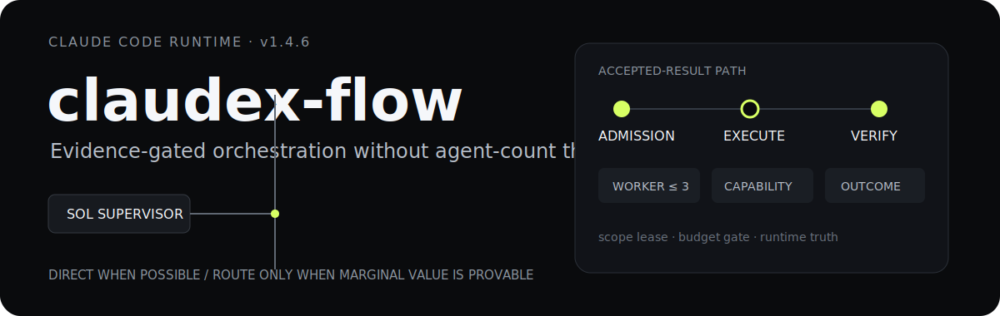
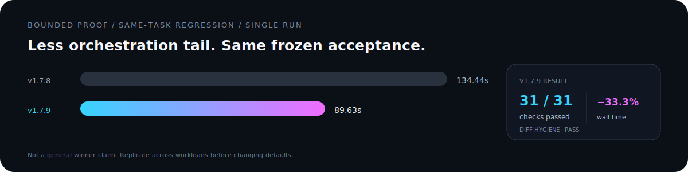
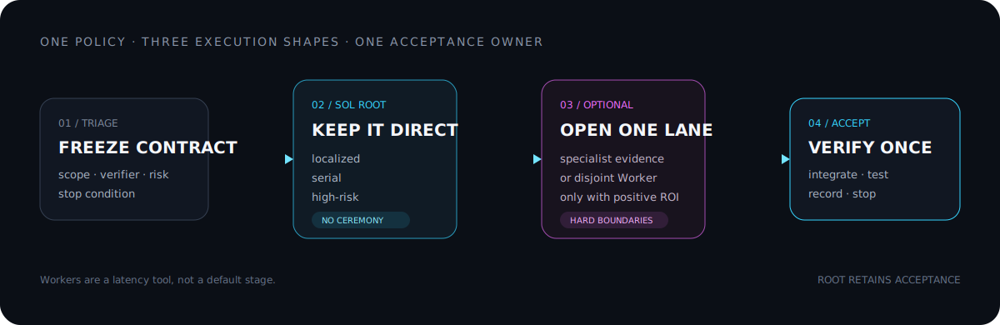

<p align="center">
  
</p>

<p align="center">
  <a href="https://github.com/raydocs/claudex-flow/releases/latest"></a>
  <a href="./LICENSE"></a>
  
</p>

<p align="center">
  An efficiency-first orchestration runtime for Claude Code: <strong>GPT-5.6 Sol supervises</strong>,
  <strong>Grok 4.5 high accelerates bounded slices</strong>, and deterministic evidence decides acceptance.
</p>

<p align="center">
  <a href="#install">Install</a> ·
  <a href="#how-it-routes">Routing</a> ·
  <a href="./benchmarks/v1.7.9.md">Benchmark evidence</a> ·
  <a href="https://github.com/raydocs/codex-sol-orchestration">Codex Sol Orchestration ↗</a>
</p>

> Community project. Not an official Anthropic, OpenAI, or xAI repository.

<p align="center">
  
</p>

This is one controlled regression, not a universal speed claim. The task, verifier, quality result, and limitations are recorded in [the benchmark note](./benchmarks/v1.7.9.md).

## What it changes

- **Short serial work stays direct.** No route ceremony, gate, or worker unless it can change the critical path.
- **Parallelism is admitted, not assumed.** A worker needs independent paths, an executable verifier, and a credible savings threshold.
- **The root keeps useful work.** Automatic delegation never hands the whole objective to children while the supervisor waits.
- **Integration stays compact.** Workers return bounded receipts and patch artifacts; the root runs the final project verifier once.
- **Identity and limits are explicit.** Requested model, observed model, deadlines, retries, leases, and residual risk remain visible.

## How it routes

<p align="center">
  
</p>

| Work shape | Lane | Default policy |
|---|---|---|
| Localized or tightly serial | Sol Supervisor | Direct; dynamic `medium` / `high` / `xhigh` effort at launch |
| External or historical evidence gap | Specialist capability | One bounded search, URL, repository, or Thread call |
| Two or more independent slices | Grok Worker | `grok-4.5/high`, background, disjoint write lease, hard deadline |
| Material ambiguity or unsafe verifier | Sol Supervisor | Stay direct; ask only when user intent is required |

`route_task` is zero-model policy evaluation. It does not start a model. The compiled MCP contract remains the runtime truth:

```bash
claudex-flow version
claudex-flow contract
claudex-flow doctor
```

## Install

### Requirements

- macOS or Linux; Go, Node.js, and an authenticated Claude Code CLI.
- A Claude Code-compatible gateway that exposes `gpt-5.6-sol` and `grok-4.5` under those model IDs.
- Existing provider access. **This repository contains no credentials and does not configure authentication.**

```bash
git clone https://github.com/raydocs/claudex-flow.git
cd claudex-flow
./scripts/install-claudex-flow.sh 1.7.9
```

The installer tests source first, builds locally, then installs:

```text
~/.local/bin/claudex-flow
~/.local/bin/claudex
~/.config/claudex/orchestrator.md
~/.config/claudex/settings.json
~/.config/claudex/mcp.json
```

Existing managed config is backed up under `~/.config/claudex/backups/`. The generated MCP registry contains only the local `claudex-flow` command—never a token, key, or provider configuration.

Start a new task:

```bash
claudex "implement the smallest verified fix"
```

The launcher prints a compact route receipt before Claude Code starts:

```text
claudex route: root=gpt-5.6-sol/high worker=grok-4.5/high strict=1
```

Effort resolves once at process launch: explicit quick/single-file work can use `medium`, ordinary work uses `high`, and high-risk work uses `xhigh`. Override it with `--effort` when needed.

## Runtime boundaries

| Boundary | Enforcement |
|---|---|
| Worker admission | Independent slice, deterministic verifier, ≥90 s useful work, ≥45 s estimated net savings |
| Concurrency | Root retains one slice; at most two automatic workers |
| Write safety | Exclusive path leases; overlapping scopes are rejected |
| Worker lifetime | Background by default; 180 s automatic cap, 300 s user-mandated cap |
| Verification | One integrated root verifier; one bounded repair after real failure |
| Context | Child briefs and final packets are bounded; full evidence stays in artifacts |
| Agent Teams | Disabled; native recursive Agent/Task fan-out is forbidden in strict mode |

The complete supervisor policy is versioned at [`config/claudex/orchestrator.md`](./config/claudex/orchestrator.md). The implementation lives in [`internal/mcpserver/`](./internal/mcpserver/) and [`internal/supervisorgate/`](./internal/supervisorgate/).

## Verify from source

```bash
go test ./...
go vet ./...
go test -race ./...
node --test adapter/model-filter-proxy.test.mjs
python3 scripts/canary-mcp-contract.py
```

The real Worker canary is intentionally separate because it performs a live model call:

```bash
python3 scripts/canary-worker-runtime.py
```

## Repository map

```text
config/claudex/          versioned supervisor contract
cmd/claudex-flow/       CLI and MCP entry point
internal/mcpserver/     routing, admission, worker lifecycle, integration
internal/supervisorgate root tool budgets and stop conditions
adapter/                 optional compact-model filter proxy
scripts/                 launcher, installer, deterministic canaries
thread-app/              optional read-only Thread archive UI
benchmarks/              bounded evidence and validity limits
```

## Sibling workflow

[Codex Sol Orchestration](https://github.com/raydocs/codex-sol-orchestration) applies the same efficiency-first principle to native Codex: Root Sol High, Router Sol Medium, Worker Sol High, Arbiter Sol XHigh, conditional GRILL, tier receipts, artifacts, and root acceptance.

The two repositories are intentionally separate. They share evaluation principles, not configuration or authentication state.

## Security and limits

- Never commit Claude/OAuth tokens, API keys, auth JSON, local transcripts, or gateway configuration.
- Model availability and resolved identity depend on the user's existing Claude Code/gateway setup.
- Supervisor usage is outside the MCP process; route outcome accounting marks that boundary instead of inventing a total.
- The optional Thread archive is read-only from the web surface. Ingest requires separate local configuration that is not included here.

## License

[MIT](./LICENSE)
